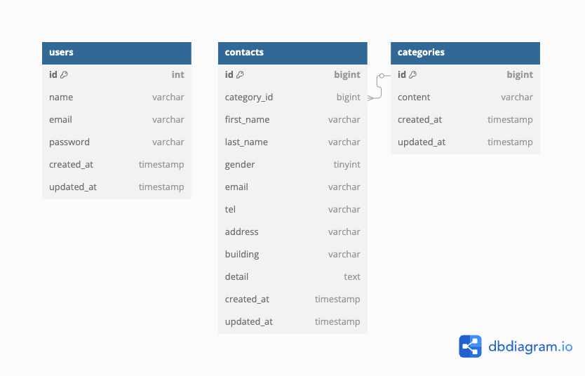

# アプリケーション名

# お問合せフォーム

## 環境構築

1. git clone コマンド
2. docker compose up -d --build
3. php コンテナ内で composer install
4. cp .env.example .env で.env ファイルを作成
5. php artisan key:generate でアプリを使用できるようにする

## 使用技術(実行環境)

- PHP: 7.4.9
- Laravel: 8.83.8
- mysql:8.0.26
- nginx:1.21.1

## ER 図

## URL

- 開発環境：http://localhost/
